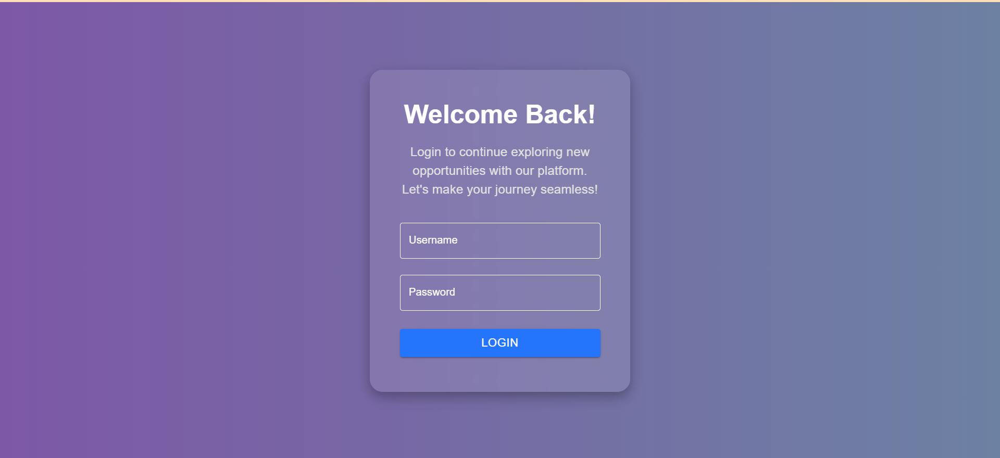
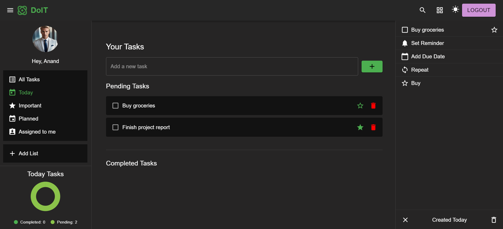

# DoIT - To-Do List Application

A simple To-Do list web application built with React. Users can manage tasks, switch between light and dark modes, and protect tasks behind a user authentication system.

---

## Table of Contents

- [Project Overview](#project-overview)
- [Demo](#demo)
- [Technologies Used](#technologies-used)
- [Features](#features)
- [Screenshots](#screenshots)
- [Installation Instructions](#installation-instructions)
- [Usage](#usage)
- [Contributing](#contributing)
- [License](#license)

---

## Project Overview

**DoIT** is a To-Do list app that allows users to manage their tasks. It includes:

- User authentication (mocked with a login form)
- Task management features (Add, Delete, Mark as Completed)
- Light/Dark Mode toggle
- A responsive UI built using **Material-UI**

---

## Demo

You can view the live demo of the project by visiting:

- [Live Demo](https://to-do-list-QuadBTECH.netlify.app)

---

## Technologies Used

- **React**: For building the user interface.
- **Redux**: For state management (authentication, tasks, etc.).
- **Material UI**: For UI components and styling.
- **React Router**: For routing between the login page and the task list page.
- **CSS**: For custom styling and ensuring responsiveness.
- **Local Storage**: To persist user authentication across sessions.

---

## Features

- **User Authentication**: Simulate login/logout functionality using local state and `localStorage`.
- **Task Management**: Add, remove, and mark tasks as completed.
- **Light/Dark Mode**: Toggle between light and dark themes.
- **Responsive Design**: The app is fully responsive, adapting to various screen sizes.
- **Private Routes**: Protect the task list page, ensuring the user is logged in.

---

## UserName and Password

- **UserName**: user
- **Password**: password

---

## Screenshots

Below are some screenshots of the application in action.

### Screenshot 1 - Task List Page



### Screenshot 2 - Login Page



---

## Installation Instructions

Follow these steps to get the project running locally on your machine.

### Prerequisites

1. **Node.js**: Ensure you have Node.js installed. If not, download it from [here](https://nodejs.org/).
2. **Git**: Make sure you have Git installed on your system. You can download it from [here](https://git-scm.com/).

### Steps to Install and Run the Project Locally

1. **Clone the Repository**:

   First, clone the GitHub repository to your local machine. Open your terminal and run the following command:

   ```bash
   git clone https://github.com/Anand98013/To-Do-List-QuadBTECH.git
